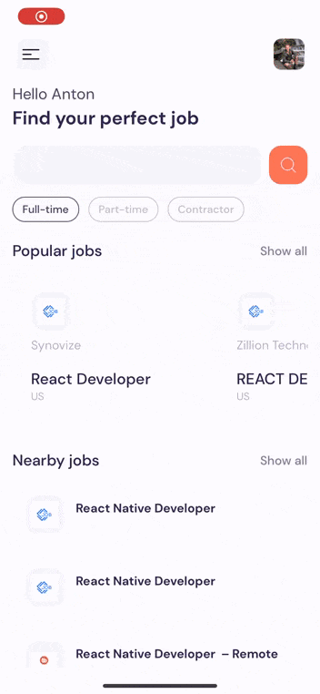

# JobFinder App 🌐💼

JobFinder is a full-stack mobile application built with React Native and Expo. It leverages the power of the Rapid API to fetch and display an up-to-date list of job vacancies based on the selected profession. Users can filter the list by popular and nearby jobs, and conveniently apply to the ones they find appealing.

# Preview 👁️


## Features ✨

1. **Real-time Job Listings:**
   - Utilizes Rapid API to fetch the latest job listings for a chosen profession.

2. **Filtering Options:**
   - Allows users to filter job listings based on popularity and proximity.

3. **Easy Application Process:**
   - Streamlines the application process, enabling users to apply to jobs directly within the app.

4. **Mobile-Optimized Design:**
   - Built with React Native and Expo, ensuring a smooth and responsive user experience on mobile devices.

## Technologies Used 🛠️

- **React Native:** The project is developed using React Native for building native mobile applications.

- **Expo:** Expo is employed to simplify the development process and enhance the app with additional features.

- **Rapid API:** The application integrates with Rapid API to fetch real-time job data efficiently.

## Running the Project on your device

Scan the following QR code with an `iOS`:


[Open this link for ios](exp://u.expo.dev/update/28667080-9e05-4db4-9fa6-1069d56b8ae6)

Scan the following QR code with an `Android`:


[Open this link for android](exp://u.expo.dev/update/c799a118-ba12-4be3-b6d8-f1736599bdb2)

## Running the Project with Expo 🚀

- Open your terminal (command prompt).

- Enter the following command to start the project:

   ```bash
   npx expo start --tunnel

Wait for the project build to complete; a QR code will appear.

- Download the [Expo Go](https://expo.dev/client) app on your mobile device

- Open Expo Go and use the built-in QR code scanner.
- Point your device's camera at the QR code displayed in the terminal.

Expo Go will automatically download and run your application.

That's it! Now you can view your application on your mobile device.